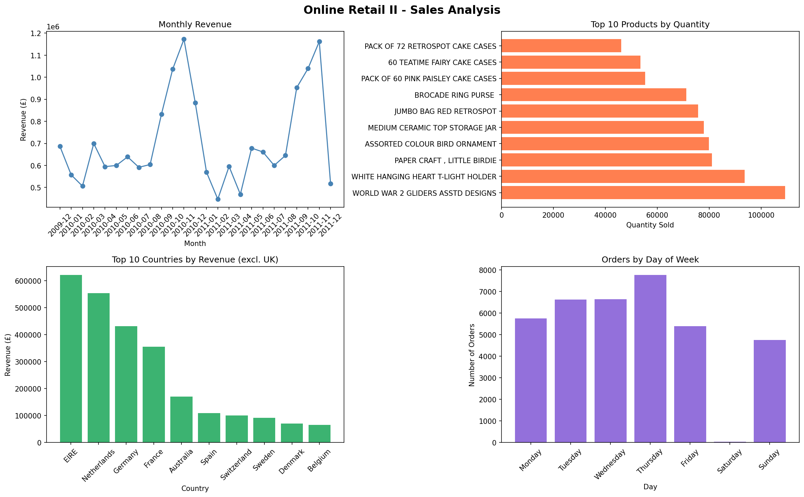

# E-Commerce Sales Analysis

## Overview
Analysis of 800,000+ online retail transactions using Python and Pandas.

## Key Findings
- Total Revenue: £17,743,429
- Unique Customers: 5,878
- Countries: 41
- Top market outside UK: Ireland (£621,631)
- Peak sales month: November 2011

## Tools Used
- Python (Pandas, Matplotlib)
- Google Colab
- Dataset: UCI Online Retail II

## Visualizations

